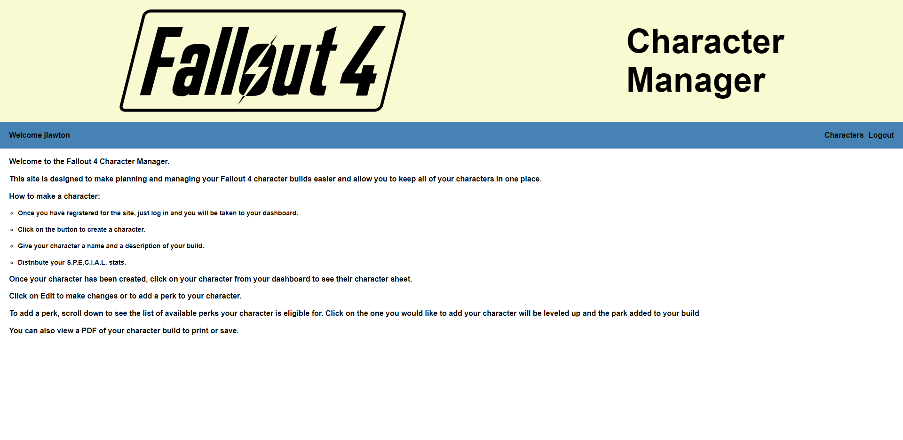
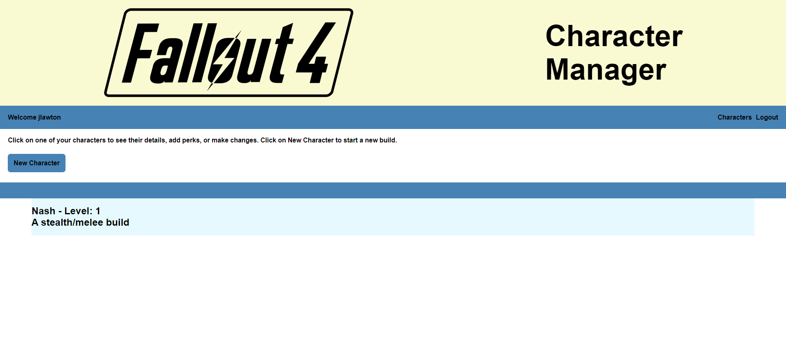
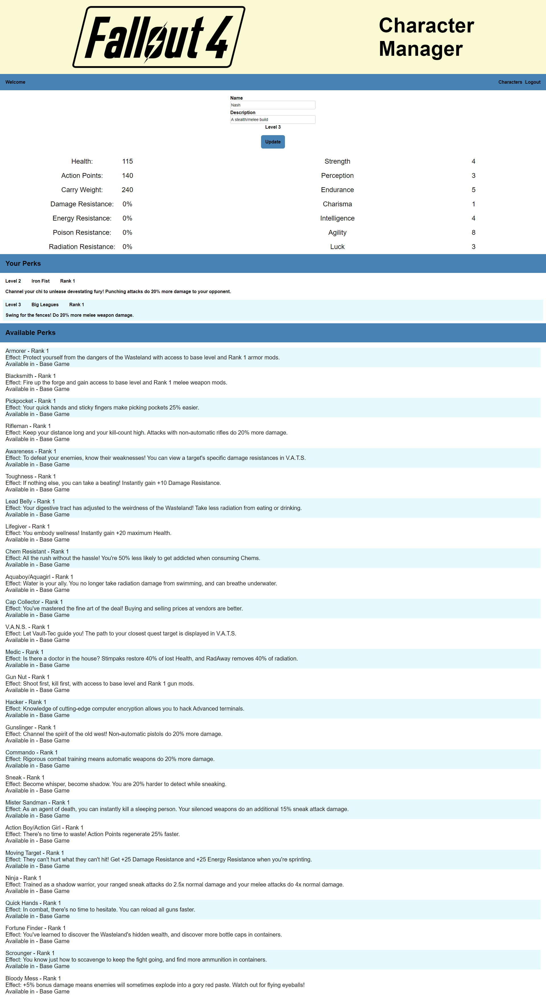

  # Fallout 4 Character Manager

  

  ## Live Link
  [Heroku Link](https://gentle-citadel-15253.herokuapp.com/)

  ## Description
  Fallout 4 Character Manager is an online resource designed to help Fallout 4 design and manage their character builds for Fallout 4. It makes character planning/building easier by assisting the player with character perk selection and allows the user to keep track of and edit all of their existing character builds. Additionally it provides PDF copies of character sheets for offline access.

  ## Screenshots
  
  
  

  ## Table of Contents
  * [Description](#description)
  * [Installation](#installation)
  * [Usage](#usage)
  * [License](#license)
  * [Contribution](#contribute)
  * [Questions](#questions)

  ## Installation
  The live application is available at https://gentle-citadel-15253.herokuapp.com/. The source can be cloned from the GitHub repo and from there, you will need to install dependencies with "npm install". Once that has been completed, use Node to launch server.js.

  ## Usage
  In order to make use of FO4 Character Manager, you will first need to register an account. Once done, you can then start creating a new character. From the character dashboard, select New Character and then you may distribute your S.P.E.C.I.A.L. stats. The application assumes the user has a basic understanding of Fallout 4. If you would like to clarify what the stats or any of the other game information does, I recommend the Fallout wiki. Once your stats are distributed, create your character. One the dashboard, all of your created characters will be shown. Click a character to bring up their character sheet and from there you can choose to Edit the character, Open the PDF character sheet, or Delete the character. Editing the character will allow you to change the character name or description. Scrolling down you will see your available perks for your level listed. Select one and if you are sure you would like to add it, click on the apporpriate button to confirm. Ther perk will be added and your character will be "leveled up". The list of available perks will be adjusted to show you what is available at your new level and you can repeat the process until you have finished your build. NOTE: Fallout 4 is an open ended game so there is no real max-level. You can continue leveling your character and adding perks until you have run out of perks to add.

  ## License
  This software is licensed under the [MIT license](https://choosealicense.com/licenses/mit/).

  ## Contribution
  This project follows the guidelines of the [Contributor Covenant](https://www.contributor-covenant.org/version/2/0/code_of_conduct/). If you are interested in contributing, please contact me at my email in the Questions section of this README.

  ## Questions
  If you have any questions about this project, you can email me at joe.lawton@outlook.com.
  For other projects, check out my [GitHub](https://github.com/jdlawton).
